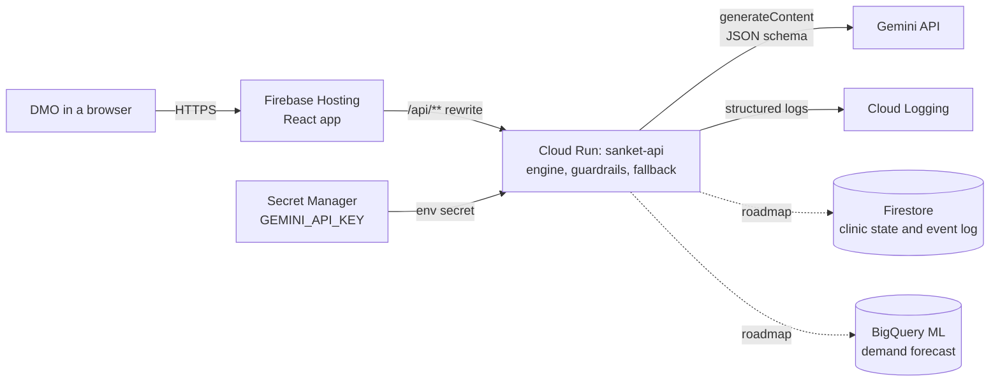

# Architecture overview

Sanket runs on Google Cloud. Firebase Hosting serves the web app. A Cloud Run service holds the safety rules and calls the Gemini API. The API key is kept in Secret Manager.

Solid lines are built and in this repo. Dotted lines are the roadmap and are **not** built.

## Google Cloud services

| Service | Role in Sanket | Status |
|---|---|---|
| Firebase Hosting | Serves the React app and forwards `/api/**` to Cloud Run, so the browser never sees the API key or a second origin | Built (`firebase.json`) |
| Cloud Run | Runs `sanket-api`: engine rules, Gemini calls, guardrails, fallback, rate limit | Built (`Dockerfile`, `server/`) |
| Secret Manager | Holds `GEMINI_API_KEY`, mounted as an environment variable | Built (deploy command in README) |
| Gemini API | Explains and writes: donor reasoning, local-language text, early-warning brief, message check-in | Built (`server/gemini.js`, `prompts/`, `schemas/`) |
| Cloud Logging | Reads structured JSON logs (`severity`, `event`) for fallbacks and guardrail overrides | Built (automatic on Cloud Run) |
| Firestore | Would store live clinic state and the audit log | Roadmap |
| BigQuery ML (AI.FORECAST with TimesFM) or Vertex AI | Would replace the straight-line forecast with a trained model | Roadmap |

## Request walk-through: recommending a transfer

1. The browser sends `POST /api/dispatch` with clinic data. Firebase Hosting forwards it to Cloud Run.
2. `engine.js` calculates days of supply, vials needed and every donor's eligibility. Tier 1 is the same district within 35 km. Tier 2 is another district within 80 km.
3. Only donors that passed every rule are sent to Gemini, with `prompts/dispatch.system.md` and `schemas/dispatch.schema.json`. Gemini picks one and explains why.
4. Code checks the answer. If the donor is not on the eligible list, code uses the nearest eligible donor and logs a guardrail override. Gemini never sets the vial count, dispatch ID or restock token.
5. Code writes the drug name, vial count and temperature into the waybill from `config/languages.json`.
6. A second, separate Gemini call translates the local text back into English so a DMO who cannot read that language can check it.
7. The response returns to the browser. A DMO must approve (two DMOs for Tier 2). Nothing moves before that.
8. If the primary model (`GEMINI_MODEL`) fails or takes over 8 seconds, the fallback model (`GEMINI_FALLBACK_MODEL`) is tried for up to 8 seconds. The response says which one answered in `model`. If both fail, step 3 to 6 are replaced by templates and the response says `source: fallback`.

## Safety design

- **Code decides, Gemini writes.** Every rule that could harm a patient is plain code with tests.
- **A person approves.** The API only recommends. Dispatch is a DMO action in the app.
- **No key in the browser.** The key exists only in Secret Manager and the Cloud Run environment.
- **Bounded inputs.** Request size limit, 30 requests per minute per IP, input checks on every route.
- **Language safety.** Templates keep the medicine name, count and temperature out of the model's hands. Each language has a `verified` flag that stays `false` until a native speaker reviews it.

## Federated design

Each state is a separate node with its own clinics. A node learns one number from its own past stock-outs: the daily footfall growth that came before them. `POST /api/federated` accepts only `{ state, threshold, sampleCount }` from each node and returns a weighted average. Each node then blends 50% of its own value with 50% of the shared value. Clinic records are never sent to the shared route, and the route rejects them.

In this demo the nodes run inside one service. In production each state would run its own Cloud Run service and Firestore database, and only the averaging route would be shared.

## What is simulated

Clinic stock, beds, doctor attendance and footfall are sample data. No public live feed for them was found. The forecast is a simple trend. The federated network is simulated in one service.
