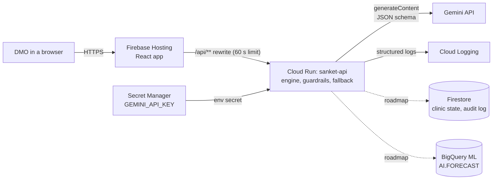

# ENGINEERING.md: Sanket

Written 30 Sep 2026. Tool and API choices below were checked against Google's current documentation on that date, not taken from memory. Where something could not be confirmed, it says so.

---

## 1. Architecture



Solid lines are built. Dotted lines are roadmap and not built.

The design rule that matters most: **code decides, Gemini writes, a person approves.** Every rule that could harm a patient is plain code with tests. Gemini explains and translates.

## 2. Choices, alternatives and trade-offs

| Area | Chosen | Alternatives considered | Trade-off in one line |
|---|---|---|---|
| Model | Gemini API. `GEMINI_MODEL` = `gemini-3.5-flash-lite`, then `GEMINI_FALLBACK_MODEL` = `gemini-3.1-flash-lite`, 8 seconds each, then the template waybill (both configurable) | `gemini-3.5-flash` (bigger, but returned 503 "high demand" on 30 Sep 2026), `gemini-3.8-flash` (newest), older `gemini-2.5-flash` | Lite models answered in about 1 second in a live test and give two chances before the template. 3.8 was not tested, and 2.5 is scheduled for retirement and limited for new users |
| Model access route | Gemini Developer API with a server-held key | Vertex AI (Google's docs now call it the Agent Platform), Firebase AI Logic from the browser | Simplest and fastest today; Vertex gives regional data residency and no key, at the cost of more setup |
| Backend | Cloud Run, Node 22, zero dependencies | Cloud Functions, Firebase Functions | A plain container is easy to test and move; Functions would be a little less setup but ties us to its runtime |
| Front door | Firebase Hosting with a `/api/**` rewrite to Cloud Run | Public Cloud Run URL called from the browser | Same origin, no CORS, key never in the browser; Hosting cuts requests at 60 seconds and only forwards to some regions |
| Secrets | Secret Manager mounted as an environment variable | `.env` on the server, key in the repo | Correct and auditable; needs a billing account and one IAM step |
| Structured output | `responseMimeType` plus `responseSchema`, checked again by code | Free text and regex | The schema constrains the model; the second check catches the rare miss |
| Forecast | Straight-line trend on 5 days, in code | BigQuery ML `AI.FORECAST` (TimesFM), `ML.FORECAST` (ARIMA_PLUS) | Explainable and instant now; less accurate than a trained or foundation model |
| Distance | Haversine on sample coordinates | Google Maps Platform routing | Free and offline; straight-line distance, not road distance |
| Language | Code templates for fixed facts plus Gemini for the reason and a back-translation | Let Gemini write the whole waybill | Drug, count and temperature cannot be corrupted; reads more formulaic |
| State store | In-memory, from the client | Firestore | Fastest to build and test; nothing persists |
| Auth | Simulated in the prototype; Firebase Authentication with Google sign-in in the design | Custom auth | Fastest for a hackathon; not real security yet |
| Federated learning | Averaging of one threshold in one service | A real per-state network | Shows the design honestly; there is no actual network between nodes |
| Frontend build | Vite and React in `web/`, ported from the approved design, `npm run build` to Firebase Hosting | Lovable export | Full control of the code and no export step; the port is hand work |

### What was checked on 30 Sep 2026

| Claim | Result |
|---|---|
| `gemini-2.5-flash` availability | Google lists it for retirement from 16 Oct 2026 and says access to 2.5 models is limited to users who have actively used them. **Not used as the default** |
| Current models | Google's docs recommend "3.5 Flash-Lite or 3.8 Flash" for new projects. `gemini-3.5-flash` (stable, no shutdown announced) and `gemini-3.1-flash-lite` (stable) appear by ID in the deprecations table. The exact ID for 3.8 Flash was not shown in the pages read |
| Live test, 30 Sep 2026 | On 30 Sep 2026, `gemini-3.5-flash` returned 503 "high demand" after 22.8 seconds on a test call, while both lite models answered in about 1 second, which is why the server tries a primary and a fallback model |
| Firebase Hosting forwarding to Cloud Run | Confirmed. Requires a Cloud Billing account (Cloud Run has a free quota) and a response within 60 seconds |
| Cloud Run in Mumbai | `asia-south1` is a Cloud Run region. That Firebase Hosting can forward to it was **not confirmed**. Fallback is `us-central1` |
| BigQuery ML forecasting | Two routes: `AI.FORECAST` with the built-in TimesFM model (no training; one page marks it Preview) and `ML.FORECAST` with `ARIMA_PLUS` (trained per series, explains its components) |
| Structured output | `responseMimeType: application/json` plus `responseSchema` is current on the Gemini API and Vertex |
| Secret Manager mounted into Cloud Run, Firebase Authentication with Google, Firestore | Standard and stable. Not re-read on the day |

## 3. Data model

```ts
interface Clinic {
  id: string; name: string; stateCode: "MH" | "TN"; districtId: string;
  lat: number; lng: number;                  // sample coordinates
  stock: number; baselineBurn: number;       // vials, vials per normal day
  bedsTotal: number; bedsOcc: number;
  doctorOnDuty: boolean; doctorName: string; // sample name
  baselineFootfall: number; footfallToday: number;
  batchNumber: string; expiryDate: string;   // ISO date
}
```

Sample data lives in `data/`. Roadmap Firestore layout: `states/{state}/clinics/{id}` for the current state and `states/{state}/clinics/{id}/readings/{day}` for the daily history, with the audit log in `states/{state}/dispatches/{id}`. Only aggregated thresholds may cross a state boundary.

## 4. Engine rules (all in `server/engine.js`)

| Rule | Formula |
|---|---|
| Current burn | `baselineBurn x max(1, footfallToday / baselineFootfall)` |
| Days of supply | `usableStock / currentBurn`. Expired stock counts as zero |
| Status | under 1 day critical, under 3 warning, otherwise stable |
| Vials needed | `ceil(2.0 x recipientBurn - recipientStock)` |
| Donor can give | `floor(donorStock - 3.0 x donorBurn)` |
| Donor eligible | doctor on duty, beds under 85%, batch in date, can cover the full need, within distance |
| Tiers | Tier 1: same district, 35 km. Tier 2: another district, 80 km, two approvals |
| Forecast | Linear fit on the last 5 days, 10 days ahead, never below baseline |
| Early warning | Projected stock-out at 72 hours or less, and daily growth at or above the node's threshold, and not already critical |
| Federated threshold | Weighted average of node thresholds by sample count, then 50% local and 50% shared |
| ETA | `distance / 40 km/h` |

## 5. API

| Route | Purpose | Notes |
|---|---|---|
| `GET /api/health` | Model name and whether a key is set | |
| `POST /api/dispatch` | Recommend a transfer | Returns `no_transfer_needed`, `no_donor` or `recommended`. Includes the waybill, reasoning, restock token and every rejected donor with its reason |
| `POST /api/warning-brief` | Early-warning alert | Returns `fires: false` without calling Gemini when the rule does not fire |
| `POST /api/checkin` | Read a stock message | Returns `needsConfirmation` under 0.7 confidence |
| `POST /api/federated` | Average thresholds | Rejects any payload that is not `{ state, threshold, sampleCount }` |

Limits: 200 KB body, 30 requests per minute per IP, 8 second Gemini timeout.

## 6. Gemini integration

| Concern | How it is handled |
|---|---|
| Prompts | One file per job in `prompts/`, loaded at start |
| Structured output | Schemas in `schemas/` are sent as `responseSchema` and checked again in `validate()` |
| Choice of donor | Gemini sees only donors that already passed every rule. A pick outside that list is overridden and logged |
| Numbers and IDs | Vial count, dispatch ID and restock token come from code, never from Gemini |
| Fixed facts in the waybill | Drug name, vial count and temperature come from `config/languages.json` templates |
| Language check | A second, separate call translates the local text back to English for the DMO |
| Unreviewed languages | Marathi, Hindi and Tamil have `verified: false`. The UI shows a chip until a native speaker signs off |
| Failure | Timeout or any error returns a template waybill with `source: "fallback"` and a `gemini_fallback` log line |

## 7. Security and privacy

- The Gemini key exists only in Secret Manager and the Cloud Run environment.
- The browser never sees a key or a second origin.
- No personal data is collected. Stock, bed and doctor counts are facility data, not patient data.
- Every route validates input shape and size. The federated route rejects clinic records.
- Roadmap: Firebase App Check on the API, per-user rate limits, an audit log, and per-state data residency.

## 8. Testing

Fourteen tests in `test/server.test.js`, all passing on 30 Sep 2026:

- One-clinic surge needs 16 vials and picks Shivpuri, 18.4 km, 28 minutes.
- District-wide surge escalates to Tier 2 and picks Lonand, 78 minutes.
- Tamil Nadu picks Perambalur.
- An expired batch counts as zero stock.
- A donor always keeps at least 3 days.
- Early warning fires about 61 hours ahead on the first surge day, and stays quiet on a calm day.
- Federated averaging gives 0.139 shared, 0.129 for Maharashtra, 0.159 for Tamil Nadu.
- Dispatch: code, not Gemini, sets IDs and quantity; a bad donor pick is overridden; a Gemini failure gives a fallback waybill; Tier 2 needs two approvals; no transfer when the clinic is fine.
- The federated route rejects clinic data. The check-in route degrades gracefully.

**Not tested:** live calls to the Gemini API, the deployed Cloud Run service, Firebase Hosting rewrites, and the React app against the API. The tests use a stand-in for Gemini.

## 9. Deploy

See `README.md`. In short: enable the APIs, store the key in Secret Manager, `gcloud run deploy` from the repo root, build the web app, `firebase deploy --only hosting`. Confirm the model ID in Google AI Studio and the region before the first deploy.

## 10. Observability

Cloud Run reads JSON log lines. Fields: `severity`, `event` (`dispatch`, `gemini_fallback`, `unhandled`, `listening`), plus `source`, `tier`, `vials`, `donor`, `guardrail`. Watch `gemini_fallback` and `guardrail` counts. Both should be low.

## 11. Scaling path

1. One Cloud Run service per state, each with its own Firestore database. The averaging route stays shared.
2. Replace the straight-line forecast with BigQuery ML `AI.FORECAST` (TimesFM) for clinics with short history, or `ARIMA_PLUS` where an explanation is needed.
3. Feed real stock through existing state inventory systems. No public live feed for PHC stock, beds or doctor attendance was found.
4. Split a large need across several donors.
5. Data residency: keep each state's data in an Indian region.

## 12. Risks

| Risk | Mitigation |
|---|---|
| Model ID wrong or not available to the key | Configurable via `GEMINI_MODEL`. Fallback waybill keeps the demo alive |
| Hosting rejects the Cloud Run region | Use `us-central1` and edit `firebase.json` |
| No billing on the project | Check hackathon credits first. Cloud Run and Secret Manager need billing enabled |
| Local-language text is wrong | Templates plus back-translation plus a visible "not reviewed" chip. Native speaker review before the video |
| Simulated data mistaken for real | "Sample data" on every screen and in the README |
| Single donor cannot cover the need | Tier 2. Multi-donor split is roadmap |

## 13. Self-check against a generic engineering doc

- A generic doc names tools from memory. This one records what was checked, what was not confirmed, and that the obvious default model is being retired.
- A generic doc claims tests. This one lists what the tests cover and what is untested.
- A generic doc hides the gaps. Section 8 and 12 name them.
- Weak spot left honest: everything that touches Google Cloud in production is designed and documented but not yet deployed or run.
