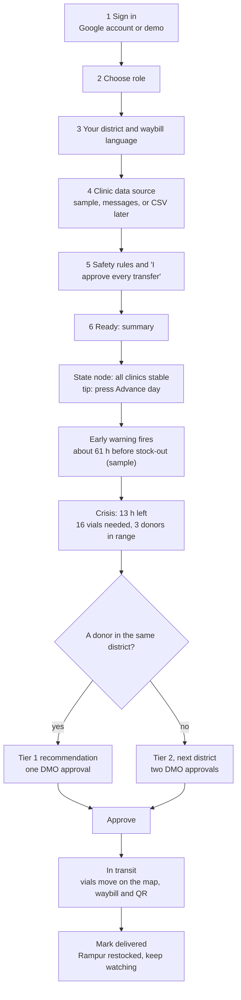

# User journey

## Who and what

| Person | Goal | Where they go | Status in the prototype |
|---|---|---|---|
| District Medical Officer (primary) | Know before a clinic runs out, approve a safe transfer | Sign in, setup, State node, approve, delivered | **Built** (click-through) |
| State health cell | See all districts and the shared model | Sign in, setup, National view | Roadmap. The National tab and the "Shared across states" card exist as design |
| PHC medical officer | Report stock without forms | A WhatsApp or SMS message, read by Gemini | Preview (the example is on setup step 4). Route exists in the API |
| Driver | Carry medicine correctly | Printable waybill in their language | Waybill tab (language switches with the setup choice) |

## The DMO journey, step by step

## Screens

| # | Screen | Built |
|---|---|---|
| 1 to 6 | Onboarding: sign in, role, district and language, data source, safety rules, ready | Yes |
| 7 | State node: timeline, map, clinics (tiles, table, charts), action card, forecast, waybill, log, impact and shared-across-states tabs | Yes |
| 8 | National view | No (roadmap) |
| 9 | Anonymized export | No (optional) |

## What setup changes

- **Waybill language** on setup step 3 sets the local-language line on the waybill (English, Marathi, Hindi or Tamil). Marathi, Hindi and Tamil stay marked "not yet reviewed" until a native speaker signs off.
- **Role** other than District Medical Officer shows a note. The demo still opens the DMO view.
- **Data source** is informational. The prototype uses sample data either way.
- **Safety rules** must be acknowledged before setup can continue.

## Honest limits

- Sign-in is simulated. The deployed app is designed for Firebase Authentication with Google accounts.
- The district is fixed to District A, Maharashtra for the DMO. In a real deployment an administrator assigns it to the account.
- Only the DMO journey is clickable end to end.

## Update, 30 Sep 2026

- The dashboard is action-first. The alert, transfer plan, vial icons and Approve button sit in one card.
- The timeline strip is labelled as demo controls. It lets a viewer jump to steps. A real product would not let anyone skip approval.
- The onboarding is to be redesigned in the morning. Brief: `DESIGN.md`, section 10.
